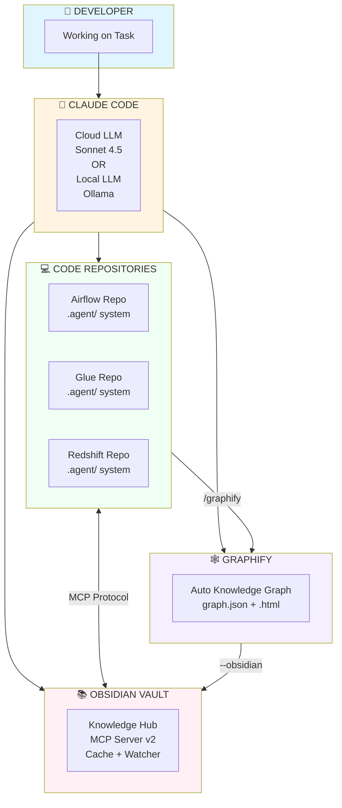
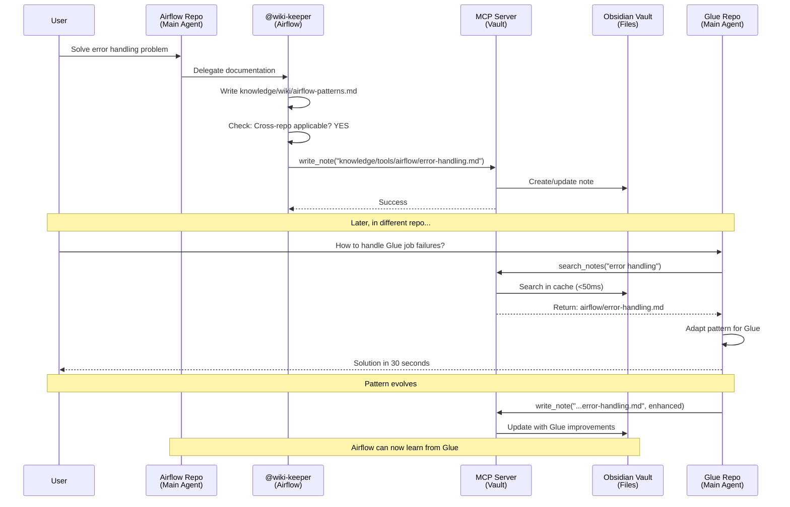
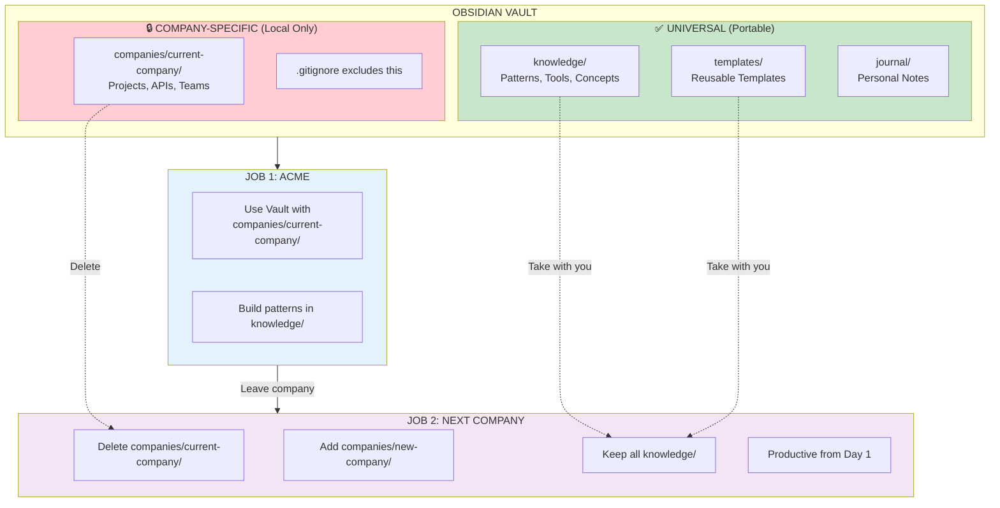
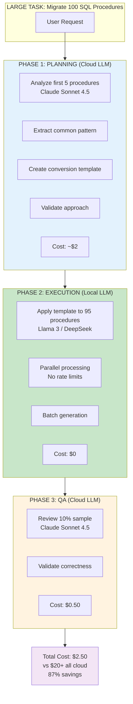
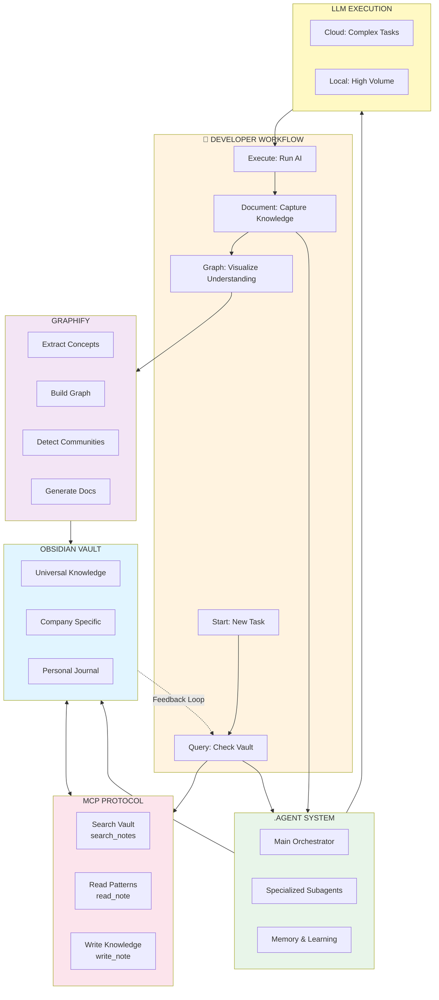
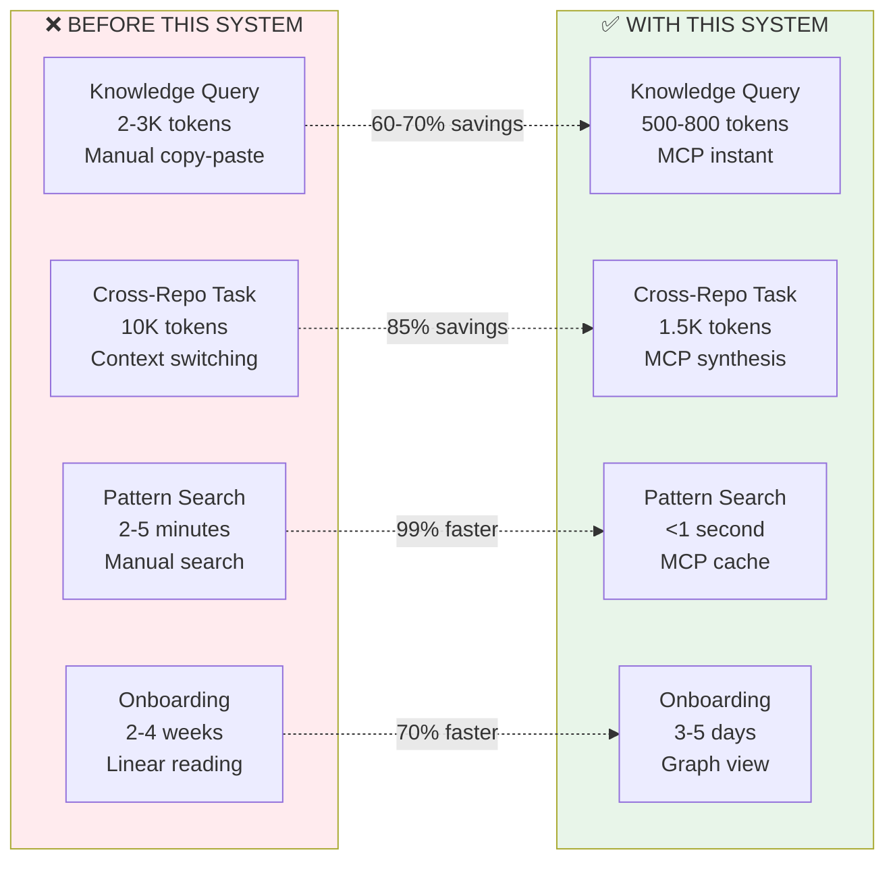
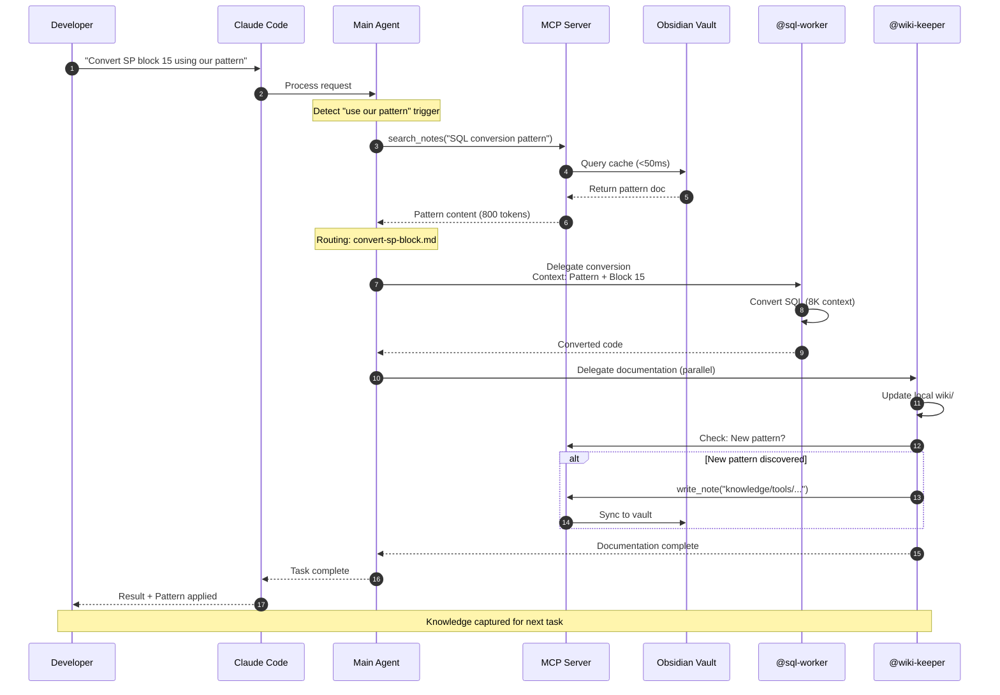

# The Complete AI Ecosystem - Visual Diagrams

**Companion to**: [[Complete Ecosystem Overview]]  
**Date**: 2026-06-04  
**Format**: Mermaid diagrams (render in Obsidian with Mermaid plugin)

---

## 🎨 Diagram 1: System Overview (High-Level)



---

## 🎨 Diagram 2: Knowledge Flow Architecture

```mermaid
graph LR
    subgraph Repo1["AIRFLOW REPO"]
        A1[Main Agent]
        A2[@wiki-keeper]
        A3[knowledge/wiki/]
        A1 -->|delegates| A2
        A2 -->|writes| A3
    end
    
    subgraph Vault["OBSIDIAN VAULT"]
        V1[MCP Server v2]
        V2[knowledge/tools/]
        V3[knowledge/architecture/]
        V1 --> V2
        V1 --> V3
    end
    
    subgraph Repo2["GLUE REPO"]
        G1[Main Agent]
        G2[@wiki-keeper]
        G3[knowledge/wiki/]
        G1 -->|delegates| G2
        G2 -->|writes| G3
    end
    
    A2 -->|MCP<br/>write_note| V1
    V1 -->|MCP<br/>search_notes| G1
    G2 -->|MCP<br/>write_note| V1
    
    A3 -.->|sync| V2
    V2 -.->|query| G3
    
    style Repo1 fill:#e3f2fd
    style Vault fill:#fce4ec
    style Repo2 fill:#f1f8e9
```

---

## 🎨 Diagram 3: .agent System Architecture (Single Repo)

```mermaid
graph TB
    subgraph User["USER REQUEST"]
        U["Convert block 15<br/>of stored procedure"]
    end
    
    subgraph Main["MAIN ORCHESTRATOR (10K context)"]
        M1[index.md<br/>Routing Rules]
        M2[memory/facts.md<br/>Project Context]
        M3[memory/working.md<br/>Active Tasks]
    end
    
    subgraph Skills["SKILLS (Entry Points)"]
        S1[convert-sp-block.md]
        S2[validate-migration.md]
        S3[query-vault.md<br/>NEW v5.1]
    end
    
    subgraph Subagents["SPECIALIZED SUBAGENTS (5-8K each)"]
        SA1[@sql-worker<br/>SQL Conversion]
        SA2[@validator<br/>Test Execution]
        SA3[@fixer<br/>Debugging]
        SA4[@wiki-keeper<br/>Documentation]
        SA5[@researcher<br/>Analysis]
    end
    
    subgraph MCP["MCP ACCESS"]
        MCP1[Query Vault<br/>search_notes]
        MCP2[Read Patterns<br/>read_note]
        MCP3[Sync Knowledge<br/>write_note]
    end
    
    U --> M1
    M1 --> M2
    M1 --> M3
    M1 --> S1
    S1 --> SA1
    SA1 --> SA2
    SA2 -.->|if failed| SA3
    SA1 -.->|parallel| SA4
    
    M1 --> S3
    S3 --> MCP1
    S3 --> MCP2
    SA4 --> MCP3
    
    style User fill:#fff3e0
    style Main fill:#e8eaf6
    style Skills fill:#f3e5f5
    style Subagents fill:#e0f2f1
    style MCP fill:#fce4ec
```

---

## 🎨 Diagram 4: MCP Server Architecture (Detailed)

```mermaid
graph TB
    subgraph Server["MCP SERVER (Node.js Process)"]
        S1[index.ts<br/>Main Server]
        S2[In-Memory Cache<br/>Map<path, content>]
        S3[Backlink Index<br/>Map<note, links[]>]
        S4[File Watcher<br/>chokidar]
        
        S1 --> S2
        S1 --> S3
        S1 --> S4
        
        subgraph Tools["5 MCP TOOLS"]
            T1[search_notes<br/>Full-text search]
            T2[read_note<br/>Get content]
            T3[write_note<br/>Create/Update]
            T4[get_links<br/>Forward links]
            T5[get_backlinks<br/>Reverse links]
        end
        
        S1 --> Tools
    end
    
    subgraph Vault["OBSIDIAN VAULT FILES"]
        V1[knowledge/]
        V2[companies/]
        V3[journal/]
        V4[templates/]
    end
    
    subgraph Clients["MCP CLIENTS"]
        C1[Airflow Repo<br/>Claude Code]
        C2[Glue Repo<br/>Claude Code]
        C3[Redshift Repo<br/>Claude Code]
    end
    
    Vault --> |load on startup| S2
    Vault --> |watch changes| S4
    S4 --> |update| S2
    S4 --> |rebuild| S3
    
    C1 <-->|JSON-RPC<br/>stdio| Server
    C2 <-->|JSON-RPC<br/>stdio| Server
    C3 <-->|JSON-RPC<br/>stdio| Server
    
    style Server fill:#e8f5e9
    style Vault fill:#fff3e0
    style Clients fill:#e3f2fd
    style Tools fill:#fce4ec
```

---

## 🎨 Diagram 5: Graphify Pipeline

```mermaid
graph LR
    subgraph Input["INPUT"]
        I1[Code Files<br/>.py .ts .go]
        I2[Documents<br/>.md .txt .pdf]
        I3[Images<br/>.png .jpg]
        I4[URLs<br/>Papers, Blogs]
    end
    
    subgraph Extract["EXTRACTION"]
        E1[Parse Files]
        E2[Extract Concepts<br/>LLM or Structural]
        E3[Extract Relationships<br/>EXTRACTED vs INFERRED]
        E4[Build Graph<br/>Nodes + Edges]
    end
    
    subgraph Analyze["ANALYSIS"]
        A1[Community Detection<br/>Louvain Algorithm]
        A2[Centrality Analysis]
        A3[Path Finding]
    end
    
    subgraph Output["OUTPUT"]
        O1[graph.json<br/>Structured Graph]
        O2[graph.html<br/>Interactive Viz]
        O3[GRAPH_REPORT.md<br/>Plain Language]
        O4[Obsidian Vault<br/>--obsidian flag]
    end
    
    Input --> Extract
    Extract --> Analyze
    Analyze --> Output
    
    style Input fill:#e3f2fd
    style Extract fill:#f3e5f5
    style Analyze fill:#fff3e0
    style Output fill:#e8f5e9
```



---

## 🎨 Diagram 6: Cross-Repo Pattern Discovery Workflow



---

## 🎨 Diagram 7: Delegation vs Monolithic (Context Comparison)

```mermaid
graph TB
    subgraph Monolithic["❌ TRADITIONAL MONOLITHIC (50K context)"]
        M[Single Claude Instance]
        M1[Read 10+ files<br/>15K tokens]
        M2[Analyze code<br/>10K tokens]
        M3[Convert SQL<br/>8K tokens]
        M4[Write tests<br/>5K tokens]
        M5[Run validation<br/>4K tokens]
        M6[Debug failures<br/>6K tokens]
        M7[Update docs<br/>2K tokens]
        
        M --> M1
        M --> M2
        M --> M3
        M --> M4
        M --> M5
        M --> M6
        M --> M7
    end
    
    subgraph Delegation["✅ .AGENT DELEGATION (15K total)"]
        D[Main Orchestrator<br/>10K context]
        D1[@sql-worker<br/>8K context]
        D2[@validator<br/>6K context]
        D3[@fixer<br/>7K context]
        D4[@wiki-keeper<br/>5K context]
        
        D -->|delegates| D1
        D -->|delegates| D2
        D2 -.->|if needed| D3
        D1 -.->|parallel| D4
    end
    
    R1[Result: Context overwhelmed<br/>Slow, error-prone]
    R2[Result: Clean, fast<br/>Isolated failures<br/>Parallel execution]
    
    M --> R1
    D --> R2
    
    style Monolithic fill:#ffebee
    style Delegation fill:#e8f5e9
    style R1 fill:#ffcdd2
    style R2 fill:#c8e6c9
```

---

## 🎨 Diagram 8: Knowledge Portability Model



---

## 🎨 Diagram 9: Hybrid Cloud/Local LLM Strategy



---

## 🎨 Diagram 10: Complete Ecosystem Integration



---

## 📊 Comparison Diagrams

### Performance: Before vs After



---

## 🎯 Usage Example: End-to-End Flow



---

## 📝 Diagram Legend

### Colors
- 🔵 **Blue** - User interaction / Interface layer
- 🟢 **Green** - Processing / Agent systems
- 🔴 **Red** - Problems / Traditional approach
- 🟣 **Purple** - Knowledge / Storage
- 🟡 **Yellow** - Execution / LLM layer

### Symbols
- `→` Synchronous flow
- `-.->` Async / Optional flow
- `<-->` Bidirectional communication
- `▣` Subprocess / Component
- `◊` Decision point

---

## 🔗 Related Documents

- [[Complete Ecosystem Overview]] - Full written documentation
- [[Agent System Introduction]] - .agent system explained
- [[knowledge/tools/mcp/core/MCP Tutorial]] - MCP setup guide
- [[Index]] - Vault navigation

---

**Tip**: These diagrams render beautifully in Obsidian with the Mermaid plugin installed. You can also copy them to tools like Mermaid Live Editor (https://mermaid.live) for standalone viewing.

**Last Updated**: 2026-06-04  
**Format**: Mermaid.js syntax
